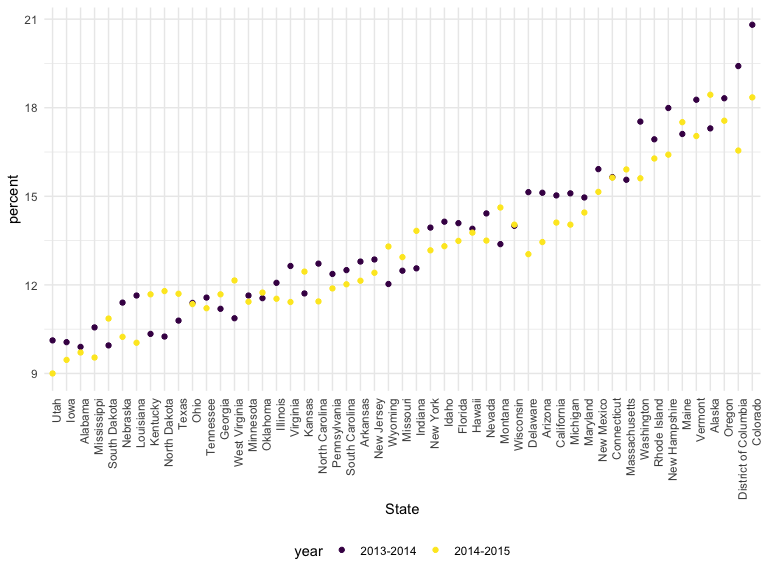
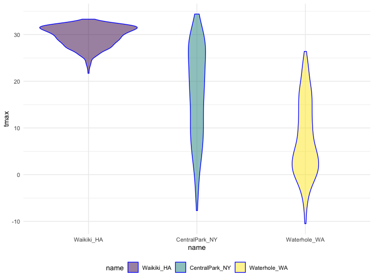
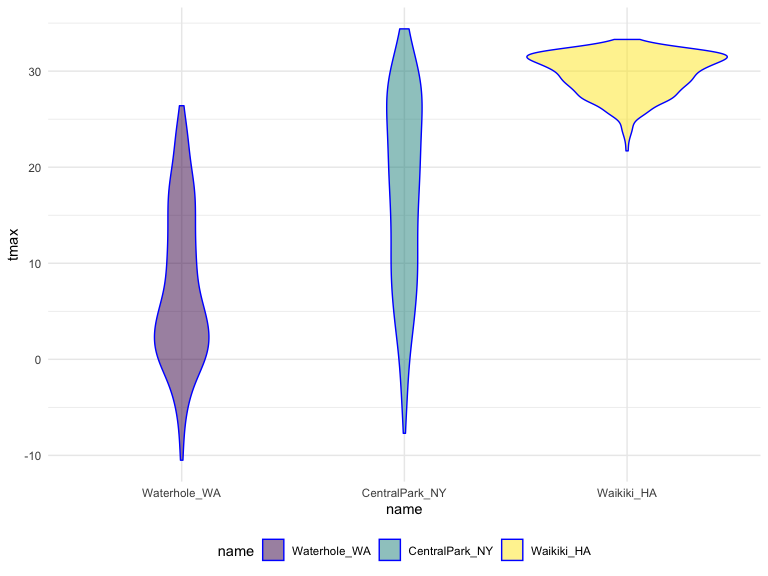
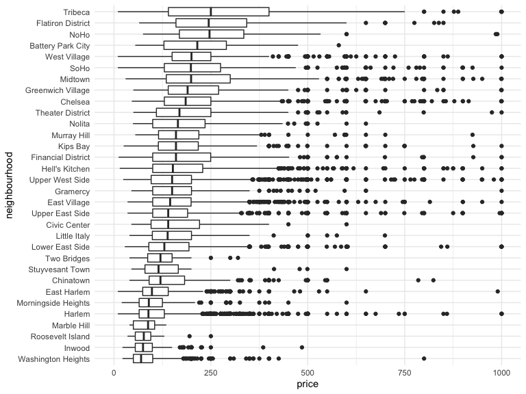

strings\_and\_factors
================
Martha Mulugeta
10/15/2019

## String Manipulation

``` r
string_vec = c("my", "name", "is", "jeff")

str_detect(string_vec, "jeff")
```

    ## [1] FALSE FALSE FALSE  TRUE

``` r
str_detect(string_vec, "m")
```

    ## [1]  TRUE  TRUE FALSE FALSE

``` r
str_replace(string_vec, "jeff", "Jeff")
```

    ## [1] "my"   "name" "is"   "Jeff"

``` r
##making Jeff capital by replacing lowercase j with J

str_replace(string_vec, "m", "M")
```

    ## [1] "My"   "naMe" "is"   "jeff"

``` r
##replace all lowercase m's with uppercase M
```

``` r
string_vec = c(
  "i think we all rule for participating",
  "i think i have been caught",
  "i think this will be quite fun actually",
  "it will be fun, i think"
  )

str_detect(string_vec, "i think")
```

    ## [1] TRUE TRUE TRUE TRUE

``` r
str_detect(string_vec, "^i think")
```

    ## [1]  TRUE  TRUE  TRUE FALSE

``` r
## ^ means starting with i think, and not just containing it as the previous str_detect

str_detect(string_vec, "i think$")
```

    ## [1] FALSE FALSE FALSE  TRUE

``` r
## $ ends with i think
```

``` r
string_vec = c(
  "Y'all remember Pres. HW Bush?",
  "I saw a green bush",
  "BBQ and Bushwalking at Molonglo Gorge",
  "BUSH -- LIVE IN CONCERT!!"
  )

str_detect(string_vec,"[Bb]ush")
```

    ## [1]  TRUE  TRUE  TRUE FALSE

``` r
##detecting match that either start with capital or lowercase B using [ ], not all caps like the last character 
```

``` r
string_vec = c(
  '7th inning stretch',
  '1st half soon to begin. Texas won the toss.',
  'she is 5 feet 4 inches tall',
  '3AM - cant sleep :('
  )

str_detect(string_vec, "^[0-9][a-zA-Z]")
```

    ## [1]  TRUE  TRUE FALSE  TRUE

``` r
##detect number followed by any letter (lower or uppercase) without space in between. Not including third character becasuse space between 5 and feet. Can specify range of numbers or letters included (i.e. 0-5 instead of 0-9 to exclude first character)
```

``` r
string_vec = c(
  'Its 7:11 in the evening',
  'want to go to 7-11?',
  'my flight is AA711',
  'NetBios: scanning ip 203.167.114.66'
  )

str_detect(string_vec, "7.11")
```

    ## [1]  TRUE  TRUE FALSE  TRUE

``` r
##detect everything that starts with 7 and has any character between it an 11. "." matches any character at all (i.e. -, :, .). No character between 7 and 11 for flight character. Will only find if there is one character between 7 and 11.
```

``` r
string_vec = c(
  'The CI is [2, 5]',
  ':-]',
  ':-[',
  'I found the answer on pages [6-7]'
  )

str_detect(string_vec, "\\[")
```

    ## [1]  TRUE FALSE  TRUE  TRUE

``` r
##detect pattern with open square bracket. Need to indicate that this is an actual character you are looking for, but need two \\ because one \ is a special character in and of itself. Need to do this for ., [, ], (, and ), 
```

\#\#Use strings in practice

``` r
pulse_data = 
  haven::read_sas("./data/public_pulse_data.sas7bdat") %>%
  janitor::clean_names() %>%
  pivot_longer(
    bdi_score_bl:bdi_score_12m,
    names_to = "visit", 
    names_prefix = "bdi_score_",
    values_to = "bdi") %>%
  select(id, visit, everything()) %>%
  mutate(
    visit = str_replace(visit, "bl", "00m"),
    visit = fct_relevel(visit, str_c(c("00", "01", "06", "12"), "m"))) %>%
  arrange(id, visit)

print(pulse_data, n = 12)
```

    ## # A tibble: 4,348 x 5
    ##       id visit   age sex     bdi
    ##    <dbl> <fct> <dbl> <chr> <dbl>
    ##  1 10003 00m    48.0 male      7
    ##  2 10003 01m    48.0 male      1
    ##  3 10003 06m    48.0 male      2
    ##  4 10003 12m    48.0 male      0
    ##  5 10015 00m    72.5 male      6
    ##  6 10015 01m    72.5 male     NA
    ##  7 10015 06m    72.5 male     NA
    ##  8 10015 12m    72.5 male     NA
    ##  9 10022 00m    58.5 male     14
    ## 10 10022 01m    58.5 male      3
    ## 11 10022 06m    58.5 male      8
    ## 12 10022 12m    58.5 male     NA
    ## # … with 4,336 more rows

``` r
##str_replace used to replace bl with 00m in the string variable visit
```

``` r
nsduh_url = "http://samhda.s3-us-gov-west-1.amazonaws.com/s3fs-public/field-uploads/2k15StateFiles/NSDUHsaeShortTermCHG2015.htm"

table_marj = 
  read_html(nsduh_url) %>% 
  html_nodes(css = "table") %>% 
  .[[1]] %>%
  html_table() %>%
  slice(-1) %>%
  as_tibble()
```

``` r
data_marj = 
  table_marj %>%
  select(-contains("P Value")) %>%
  pivot_longer(
    -State,
    names_to = "age_year", 
    values_to = "percent") %>%
  separate(age_year, into = c("age", "year"), sep = "\\(") %>%
  mutate(
    year = str_replace(year, "\\)", ""),
    percent = str_replace(percent, "[a-c]$", ""),
    percent = as.numeric(percent)) %>%
  filter(!(State %in% c("Total U.S.", "Northeast", "Midwest", "South", "West")))

##replace the lowecase letter a through c at the end of the string using the $ sign for the percent string.
```

``` r
data_marj %>%
  filter(age == "12-17") %>% 
  mutate(State = fct_reorder(State, percent)) %>% 
  ggplot(aes(x = State, y = percent, color = year)) + 
    geom_point() + 
    theme(axis.text.x = element_text(angle = 90, hjust = 1))
```



\#\#Factors \#\#Factor levels listed in alphabetical order; set
reference group if you want to change the order of the levels

``` r
weather_df = 
  rnoaa::meteo_pull_monitors(
    c("USW00094728", "USC00519397", "USS0023B17S"),
    var = c("PRCP", "TMIN", "TMAX"), 
    date_min = "2017-01-01",
    date_max = "2017-12-31") %>%
  mutate(
    name = recode(id, USW00094728 = "CentralPark_NY", 
                      USC00519397 = "Waikiki_HA",
                      USS0023B17S = "Waterhole_WA"),
    tmin = tmin / 10,
    tmax = tmax / 10) %>%
  select(name, id, everything())
```

    ## Registered S3 method overwritten by 'crul':
    ##   method                 from
    ##   as.character.form_file httr

    ## Registered S3 method overwritten by 'hoardr':
    ##   method           from
    ##   print.cache_info httr

    ## file path:          /Users/marthamulugeta/Library/Caches/rnoaa/ghcnd/USW00094728.dly

    ## file last updated:  2019-09-26 10:25:45

    ## file min/max dates: 1869-01-01 / 2019-09-30

    ## file path:          /Users/marthamulugeta/Library/Caches/rnoaa/ghcnd/USC00519397.dly

    ## file last updated:  2019-09-26 10:26:01

    ## file min/max dates: 1965-01-01 / 2019-09-30

    ## file path:          /Users/marthamulugeta/Library/Caches/rnoaa/ghcnd/USS0023B17S.dly

    ## file last updated:  2019-09-26 10:26:06

    ## file min/max dates: 1999-09-01 / 2019-09-30

``` r
weather_df %>%
  mutate(name = fct_relevel(name, c("Waikiki_HA", "CentralPark_NY", "Waterhole_WA"))) %>% 
  ggplot(aes(x = name, y = tmax)) + 
  geom_violin(aes(fill = name), color = "blue", alpha = .5) + 
  theme(legend.position = "bottom")
```



``` r
##releveling so the order is HA, NY, then WA. If you don't care about the last two in the order, then just list the one you want first, and the other two will be listed in alphabetical order. 
```

``` r
weather_df %>%
  mutate(name = forcats::fct_reorder(name, tmax)) %>% 
  ggplot(aes(x = name, y = tmax)) + 
  geom_violin(aes(fill = name), color = "blue", alpha = .5) + 
  theme(legend.position = "bottom")
```



``` r
##Reorder name using tmax-- look at factors you have, which one has the smallest median tmax, that is level one, and then so one. In order of tmax. 
```

``` r
data("nyc_airbnb")

nyc_airbnb %>%
  filter(neighbourhood_group == "Manhattan") %>% 
  mutate(
    neighbourhood = fct_reorder(neighbourhood, price, na.rm = TRUE)) %>% 
  ggplot(aes(x = neighbourhood, y = price)) +
  geom_boxplot() +
  coord_flip() + 
  ylim(0, 1000)
```



``` r
##Factor reorder to put neighborhood in order of some other variable -- price in this case. Remove missing values (those without price). coord_flip flips the axes. ylim limits the y-axis. 
```

\#\#What about factors and linear models…?

``` r
weather_df %>% 
  lm(tmax ~ name, data = .)
```

    ## 
    ## Call:
    ## lm(formula = tmax ~ name, data = .)
    ## 
    ## Coefficients:
    ##      (Intercept)    nameWaikiki_HA  nameWaterhole_WA  
    ##           17.366            12.291            -9.884

``` r
##Intercept is mean tmax in Central Park (reference). Change reference to Waikiki as seen below with releveling. lm for linear model. 

weather_df %>%
  mutate(name = forcats::fct_relevel(name, c("Waikiki_HA", "CentralPark_NY", "Waterhole_WA"))) %>% 
  lm(tmax ~ name, data = .)
```

    ## 
    ## Call:
    ## lm(formula = tmax ~ name, data = .)
    ## 
    ## Coefficients:
    ##        (Intercept)  nameCentralPark_NY    nameWaterhole_WA  
    ##              29.66              -12.29              -22.18
